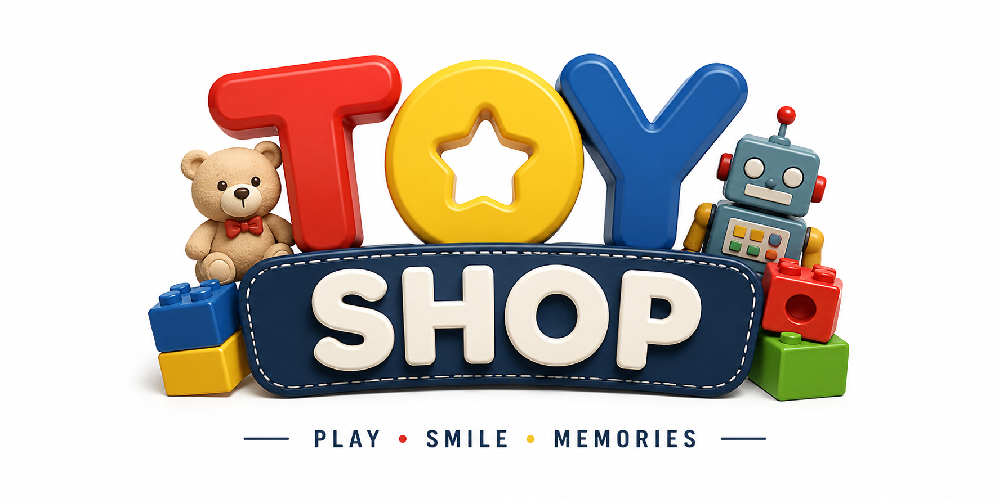

# Toy-Shop

## 프로젝트 소개

Toy-Shop은 회원, 상품, 주문, 결제, 배송까지 구현한 쇼핑몰 프로젝트입니다.

Spring Boot 기반으로 실제 온라인 쇼핑몰의 구매 프로세스를 구현하였으며 관리자 기능과 사용자 기능을 모두 제공합니다.

---

## 주요 기능

### 회원
- 회원가입
- 로그인
- 아이디/비밀번호 찾기
- 회원정보 수정
- 배송지 관리

### 상품
- 상품 목록
- 카테고리
- 상품 상세
- 검색

### 주문
- 장바구니
- 바로 구매
- 주문 관리
- 주문 내역

### 결제
- Toss Payments
- 무통장 입금

### 관리자
- 상품 관리
- 회원 관리
- 주문 관리

---

## 기술 스택

- Java 17
- Spring Boot
- Thymeleaf
- MyBatis
- MySQL
- Docker
- AWS EC2

---

## 배포 주소

http://43.203.123.217:8082